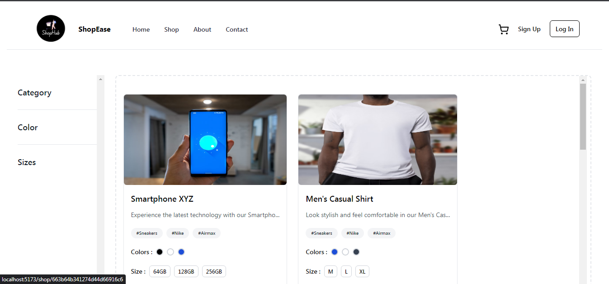
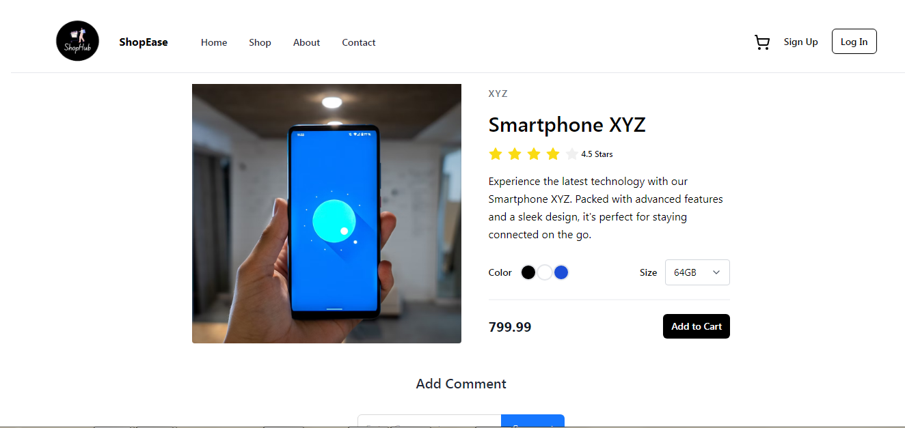
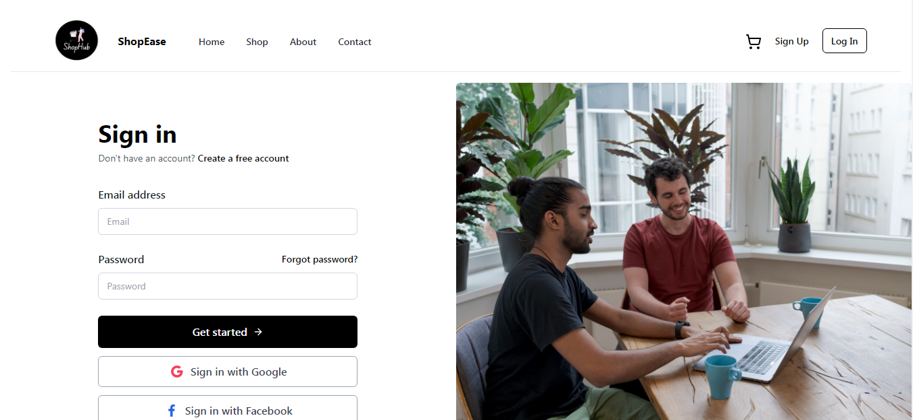
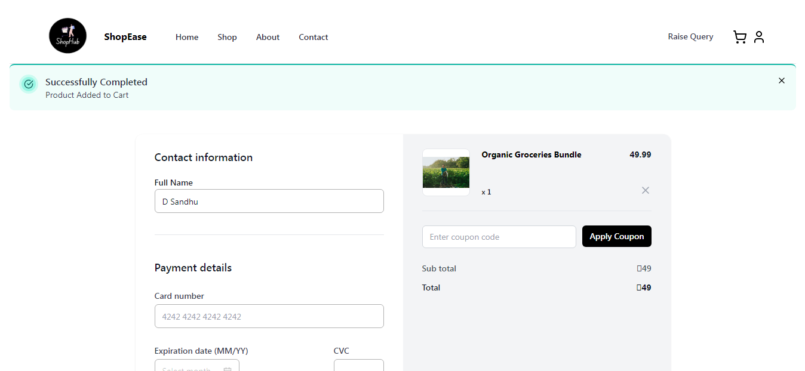
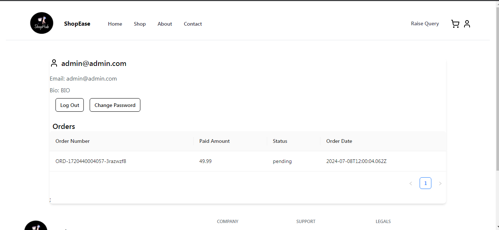
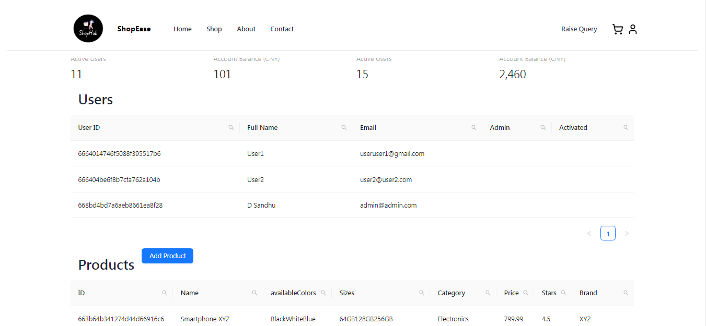

# ShopEase

Welcome to ShopEase, your one-stop destination for a wide variety of products ranging from electronics to fashion, groceries, and more. Our user-friendly e-commerce platform aims to provide an exceptional shopping experience with seamless navigation, comprehensive product details, and secure transactions.

## Features

- **User Authentication**: Secure login and signup pop-ups.
- **Responsive Design**: Tailwind CSS for a beautiful and responsive interface.
- **Product Listing**: Detailed product listings with images, descriptions, and prices.
- **Search Functionality**: Easily find products using the search bar.
- **Category Browsing**: Explore products by popular categories.
- **Featured Products**: Highlighted featured products on the homepage.

## Screenshots

Here are some screenshots of the ShopEase application:

### Homepage


### Product Listing


### Product Details


### Login Page


### Payment Page


### User Profile


### Admin Section

## Tech Stack

- **Frontend**: React.js, Tailwind CSS
- **Backend**: Node.js, Express.js
- **Database**: MongoDB
- **Routing**: React Router
- **State Management**: React Hooks

## Getting Started

To get a local copy up and running follow these simple steps.

### Prerequisites

- Node.js
- npm (Node Package Manager)

### Installation

1. Clone the repo
   ```sh
   git clone https://github.com/DuvenderSandhu/shopease-backend.git
1. Install NPM packages
   ```sh
   npm install

1. Start the development server
   ```sh 
   npm run dev

### Contributing

Contributions are what make the open-source community such an amazing place to learn, inspire, and create. Any contributions you make are greatly appreciated.
```sh
1. Fork the Project
2. Create your Feature Branch (git checkout -b feature/AmazingFeature)
3. Commit your Changes (git commit -m 'Add some AmazingFeature')
4. Push to the Branch (git push origin feature/AmazingFeature)
5. Open a Pull Request
```
### Contact

Duvender Sandhu - anusandhu666@gmail.com


